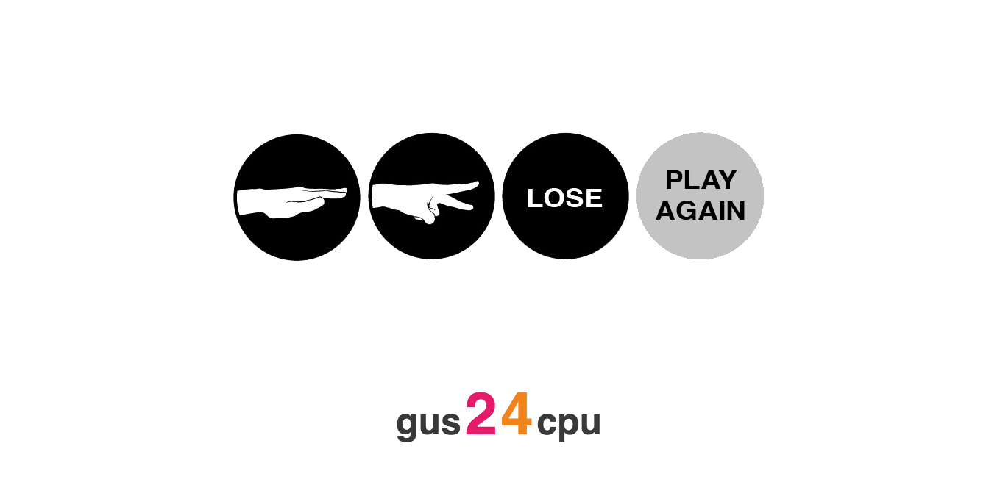

#Rock Paper Scissors

Introduction
--------------------
In this week 3 weekend challenge at Makers we were given the task of recreating the classic Rock Paper Scissors game in the browser, using Ruby and Sinatra.

Link
---------------
The final app can be viewed here: [http://gus-rps.herokuapp.com/](http://gus-rps.herokuapp.com/)

Screenshot
---------------

Languages - Frameworks - Tools
--------------------------------

- Ruby
- Sinatra,
- JavaScript,
- JQuery,
- CSS

Enhancements
------------------
One enhancement could be to add multiplayer functionality.
